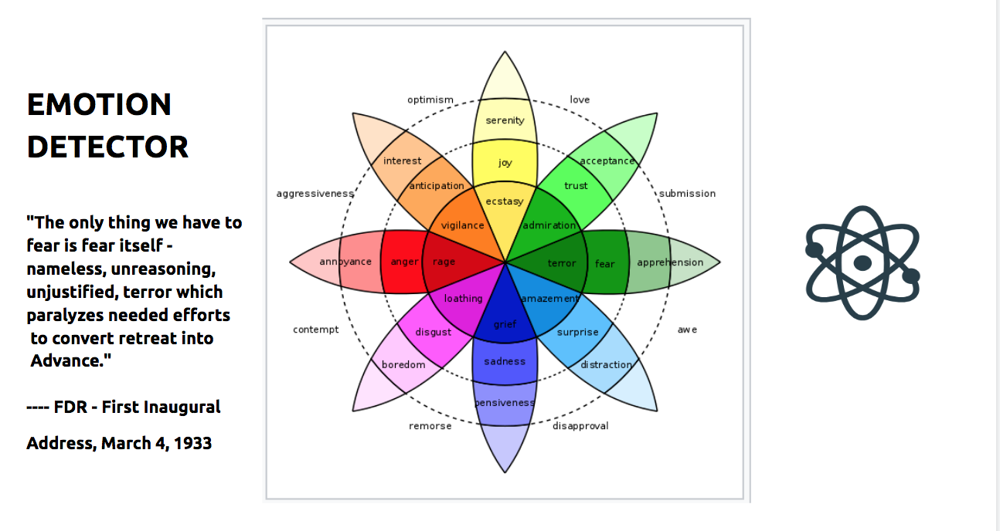

# Detecting Emotions and Topic Modeling in Elections Related Suspended Twitter Accounts Allegedly Originated from Russia. 

|| |
|----------------------------------------------|------------------------------------------|

## Table of Contents --- make it a list of links at the end when everythong is ready ---

## Introduction and Project Goals
  Creating healthy public conversation through data analysis and thorough __text analysis__ of suspended Twitter accounts originated from Russia using **Twitter's Elections Integrity Dataset** that was published in January 2019.  
  
  In line with Twitters’ principles of transparency and to improve public understanding of alleged foreign influence campaigns, Twitter is making publicly available archives of Tweets and media that it believes resulted from potentially state-backed information operations on its service. 
    **Ivan Corneillet**, instructor at Twitter University and former instructor here at Galvanize brought to us recently released data set (_January 2019_) of suspended accounts originated from Russia. It's been a topic of my interest already and when Ivan brought it in I knew that this is exactly what I want to be using for my Capstone Project.  

## Problem: 

  **Engineering Public Opinion** is a significant concern to the public, officials and every one, really. It is on the forefront of any modern political and/or money divide. It is the problem of our time and Social networks have come under fire for their inability to prevent the manipulation of news and information by potentially malicious actors.  

 

* [Twitter Election Integrity Data Set, Russia](https://about.twitter.com/en_us/values/elections-integrity.html#data) include all public, non deleted Tweets from accounts Twitter believes are connected to state-backed information operations. Tweets deleted by these users prior to their suspension (which are not included in this dataset) comprise less than 1% of their overall activity.   
* Dataset consisted of 416 accounts allegedly originated in Russia and their tweet content. 

## Libraries and Top Tools Used:

`Pandas, numpy`  - Data Handling, Linear ALgebra  
`Gensim, gensim corpora, gensim Coherence Model, Sklearn` - Topic Modeling  
`Sklearn CountVectorizer`  
`Matplotlib, Seaborn, pyLDAvis, WordCloud` -- Visualizations  
`NLTK, nltk.stem.wordnet.WordNetLemmatizer, nltk.stem.snowball.SnowballStemmer` - Text preprocessing using NLP  
Python Regual expressions library, twitter text preprocessor  
`Vader` - Twitter Sentiment  
 
Target variable:  **Natural Language Components of tweets text**, it’s similarity and emotion weight of tweets. With this in mind I started with looking into the texts tweets.  

1. First Thing: Tweets or Retweets?  
**171,959.0** number of **tweets** 143,308.0 unique tweets , 28,651.0 repeated tweets  
**59,3287.0** number of **retweets**, 524,243.0 unique retweets, 69,044.00 repeated retweets  
For this project I subseted the data by the tweets only. I'm planning to continue my research on the Retweet subset as well.  
2. Second thing to look: **Languages**.   
Account_Language:  
	  162342 -- English  
	  8125   -- French  
	  1237   -- Russian  
	  185    -- Indonesian  
	  53     -- Turkish  
	  17     -- Romanian  
									
**ADD COUNT PLOTS FROM SEABORN HERE
3. User Reported Location 

|| ||
|:----:|:----:|:----:|

Mostly user reported location was **US** across both tweets and retweets, with retweets not coming specifically from any countries from Europe/Asia/Russia. Under **worldwide** category were aggregated reported locations that had more than one location listed in their profile.  

**Final Subset** included **333** Accounts and their Tweet Texts.  
 
## Text Pipeline and NLP

 

1.1.Words were lemmatized, stemmed. Punctuation removed. 
In linguistic morphology and information retrieval in **lemmatization** we are removing word endings to get to our target, the base or dictionary form of a word.  
Kittens - kitten, better - good, walking  - walk. 

1.2. Stemming, the process of reducing inflected (or sometimes derived) words to their word stem, base or root form:
cats, catlike, and catty, cat ---> cat

`lemmer = WordNetLemmatizer()`

`stemmer = SnowballStemmer('english')`

1.3. Stop words. Noise. 
Standard stop words library from nltk was used.  
`stop_words = set(nltk.corpus.stopwords.words('english'))`

1.4 In addition the least meaningful words were arbitrary removed by the author using [**google trends**](https://trends.google.com/trends) and human comprehension. 

1.5. Emojies, Urls, Hashtags and Mentions were out of scope of this research and removed from text using [Twitter text preprocessor](https://pypi.org/project/tweet-preprocessor/):  

`pip instal tweet-preprocessor`
 

## Emotion Detector 

Most schools of thought can confirm: Emotion is often the driving force behind motivation, positive or negative as well as the ability of words represent emotional experience[1]. 

### Methodology. 
Basic Emotions: During the 1970s, psychologist Paul Eckman identified six basic emotions that he suggested were universally experienced in all human cultures. The emotions he identified were happiness, sadness, disgust, fear, surprise, and anger. 

**Emotions Detection** is an interesting blend of **Psychology** and **Technology**. As much as sentiment analyses is widely used nowadays, I wanted to have a slightly larger emotional palette rather than classic polarity analysis. 

**Tool Kit**
[Emotions Sensor Data Set available on Kaggle](https://www.kaggle.com/iwilldoit/emotions-sensor-data-set). Data set contains over 21000 unique English words classified statistically into of 7 basic emotions: 
### Disgust, Surprise, Neutral, Anger, Sad, Happy and Fear. 
Words have been manually and automatically labeled using _Andbrain_(published on Kaggle) engine from over 1.185.540 classified words, blogs, tweets and sentences. 
Using NLTK Vectorize Tweets tweet. Vocabulary Hyper Parameter is set of unique words with calculated emotions weight per word. 
`from sklearn.feature_extraction.text import CountVectorizer`
Comparing index and columns of two dataframse to make sure they are identical. 
Liear Algebra Magic:
[linalg](images/linalg.png width="1000")

## Results Discussion:
* Top interest. In tweets emotion detection time series observed **fear increased** in 2014 - 2016 right before the election. It is a very interesting observation which allows us to examine fear patterns available for research during that period of time to see if it’s noise or not and potentially opens up an important feature in decision making classifiers. 

* Quantitatively detecting emotions in social media messages can be instrumental in creating models that can classify emotional patterns of suspected accounts for controlling and managing healthy social conversation and possible ethical implications of trying to influence public opinion.  And therefore this research front should be further developed and improved upon. 
# Timeseries plots here. 

## Topic Modeling using LDA 
[Latent Dirichlet Allocation](https://en.wikipedia.org/wiki/Latent_Dirichlet_allocation) is a generative statistical model of the joint probability distribution on _X × Y, P ( X , Y )_ that allows sets of observations to be explained by unobserved groups that explain why some parts of the data are similar and what are the similarities, what are the topics, the nodes of our text,  or  the abstract "topics" that occur in a collection of documents allowing us for discovery of _hidden semantic structures in a text body_ which is the goal of this project.  

Particular words will be found in the document more or less frequently: "surf" and "ocean" will appear more often in documents about surfing, "smoked salmon" and "dill" will appear in documents about scandinavian recipes than others, and many common words that will appear equally in all topics.  
A document typically concerns multiple topics in different proportions; thus, in a document that is 80% about surfing and 20% about scandinavian recipes, there would probably be about 8 times more words acount ocean and surf than about scandinavian recipes. The "topics" produced by topic modeling techniques are clusters of similar words. A topic model captures this intuition in a mathematical framework, which allows examining a set of documents and discovering, based on the statistics of the words in each, what the topics might be and what each document's balance of topics is. 

LDA is an unsupervised technique, meaning that we don’t know prior to running the model how many topics exits in our corpus. Coherence score is a metric and main technique used to estimate the number of topics and to measure human understandability and interpretability.

## Model Evaluation. Coherence Score.  
A set of statements or facts is said to be coherent, if they support each other.
Interest into coherence measures has arisen in text mining, as unsupervised learning methods like topic models give no guarantees on the interpretability of their output. Topic models learn topics—typically represented as sets of important words—automatically from unlabeled documents in an unsupervised way. This is an attractive method to bring structure to otherwise unstructured text data. 

## ADD math on coherence score. 
`from gensim import code models.coherencemodel `
‘U_mass’

## RESULTS
Topics Model Can be seen following this link: **html link to oprn pyLDAvis: LINK        
By Examining the clusters we can identify and suggest the latent groups discovered: We can see these main Clusters: 

1. Agression. Race. Terror. Disgust.   
2. Scandals. Politics. Ashley Madison. Topless. Donald.   And other -- make a cloud
3. America Hate Shumer  
The first 3 topics are of primery interest since they are talking about American politics which is interesting find and can be considered as a feature. 

4. Zimbabwe.   WIll try to detect non english words. 
5. European tennis. Sports.  
6. Sirya  
7. Turkish, azeri.  

## Future Steps: 

* Network and Graph analysis can be applied to further determine connections between accounts and their social weights in the public conversation. 
* I wanted to investigate further where the tweets were originated from geographically: During next election create a classifier model based on this dataset to label based on previous trends and most interesting features developed based on LDA Model topics clusters.
* AI-powered keyword equipped text screener. 
* Creating a AI Tool for Emotion Analysis and Understanding.
 

## Conclusions
Inspired by the findings of this eda to continue searching for latent features available to be discovered using modern machine learning techniques and tools.
## Acknowledgements
## About me 
## References
1.  Gaulin, Steven J.C. and Donald H. McBurney. Evolutionary Psychology. Prentice Hall. 2003. ISBN 978-0-13-111529-3, Chapter 6, p 121-142.
2. 
