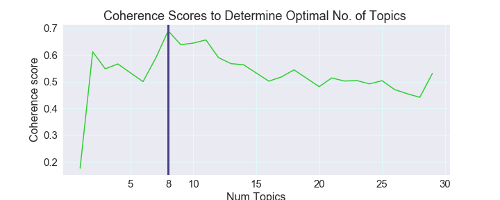

|| |
|----------------------------------------------|------------------------------------------|

## Introduction and Project Goals
  Creating healthy public conversation through data analysis and thorough __text analysis__ of suspended Twitter accounts originated from Russia using **Twitter's Elections Integrity Dataset** that was published in January 2019.  
  
  In line with Twitters’ principles of transparency and to improve public understanding of alleged foreign influence campaigns, Twitter is making publicly available archives of Tweets and media that it believes resulted from potentially state-backed information operations on its service. 
    **Ivan Corneillet**, instructor at Twitter University and former instructor here at Galvanize brought to us recently released data set (_January 2019_) of suspended accounts originated from Russia. It's been a topic of my interest already and when Ivan brought it in I knew that this is exactly what I want to be using for my Capstone Project.  

## Problem: 

  **Engineering Public Opinion** is a significant concern to the public, officials and every one, really. It is on the forefront of any modern political and/or money divide. It is the problem of our time and Social networks have come under fire for their inability to prevent the manipulation of news and information by potentially malicious actors.  

 

* [Twitter Election Integrity Data Set, Russia](https://about.twitter.com/en_us/values/elections-integrity.html#data) include all public, non deleted Tweets from accounts Twitter believes are connected to state-backed information operations. Tweets deleted by these users prior to their suspension (which are not included in this dataset) comprise less than 1% of their overall activity.   
* Russia Dataset consisted of 416 accounts and their tweet content.  

#### Data Set Features and Null Values (blue). ####

 

## Libraries and Top Tools Used:

`Pandas, numpy`  - Data Handling, Linear ALgebra  
`Gensim, gensim corpora, gensim Coherence Model, Sklearn` - Topic Modeling  
`Sklearn CountVectorizer`  
`Matplotlib, Seaborn, pyLDAvis, WordCloud` - Visualizations  
`NLTK, nltk.stem.wordnet.WordNetLemmatizer, nltk.stem.snowball.SnowballStemmer` - Text preprocessing using NLP  
`Vader` - Twitter Sentiment  
Python Regual expressions library, twitter text preprocessor  
 
## Target variable:
* **Natural Language Components of tweets text**, 
* **it’s similarity and emotion weight of tweets**   
With this in mind I started with looking into the texts tweets.  

**1. First Thing: Tweets or Retweets?**  

**171,959.0** number of **tweets** 143,308.0 unique tweets , 28,651.0 repeated tweets  
**59,3287.0** number of **retweets**, 524,243.0 unique retweets, 69,044.00 repeated retweets  

I selected **tweets** as my target

For this project subject are the tweets only. (I'm planning to continue my research on the Retweet subset as well_).  
**2. Languages**.  English was selected as a language of this research given language proportion into consideration.   
Final English Only Subset of tweets had 333 accounts 
Account_Language:   

	  162342 -- English 
	  8125   -- French 
	  1237   -- Russian 
	  185    -- Indonesian 
	  53     -- Turkish 
	  17     -- Romanian 
					

**3. User Reported Location & Tweets Volume per Location.**  
`loc_df.groupby('user_reported_location').count()['userid']` _pandas command to count users per location_
`clean_user_reportd_location(loc_df)` _cleaning and aggregating locations function in `src` folder_. 
I wrote a funciton to convert user reported locations to latitude-longitude of the city. Because I love :heart: geography I handcoded the latitudes and longitudes from the cities I needed. I used geopandas and matplotlib for the map plot.  
Below, The Volume of the tweets from each location. 

`import descartes`    
`import geopandas as gpd`   
`from shapely.geometry import Point, Polygon`  

Clean Up Cities/Countries `loc_clean.py` in `src` 

 

## Text Pipeline and NLP

 

1.1.Words were lemmatized, stemmed. Punctuation removed. 
In linguistic morphology and information retrieval in **lemmatization** we are removing word endings to get to our target, the base or dictionary form of a word.   
Kittens - kitten, better - good, walking  - walk.  

1.2. Stemming, the process of reducing inflected (or sometimes derived) words to their word stem, base or root form:  
cats, catlike, and catty, cat ---> cat  

`lemmer = WordNetLemmatizer()`  

`stemmer = SnowballStemmer('english')`  

1.3. Stop words. Noise.  
Standard stop words library from nltk was used.  
`stop_words = set(nltk.corpus.stopwords.words('english'))`  

1.4 In addition the least meaningful words were arbitrary removed by the author using [**google trends**](https://trends.google.com/trends) and human comprehension. 
additional stopwords list (_developing_) in add_stop_words.py

1.5. Emojies, Urls, Hashtags and Mentions were out of scope of this research and removed from text using [Twitter text preprocessor](https://pypi.org/project/tweet-preprocessor/):  
`pip instal tweet-preprocessor`

## BAG OF WORDS

 

 

Most schools of thought can confirm: Emotion is often the driving force behind motivation, positive or negative as well as the ability of words represent emotional experience[1]. 

### Methodology. 

Basic Emotions: During the 1970s, psychologist Paul Eckman identified six basic emotions that he suggested were universally experienced in all human cultures. The emotions he identified were happiness, sadness, disgust, fear, surprise, and anger. 

**Emotions Detection** is an interesting blend of **Psychology** and **Technology**. As much as sentiment analyses is widely used nowadays, I wanted to have a slightly larger emotional palette rather than classic polarity analysis. 

**Tool Kit**
[Emotions Sensor Data Set available on Kaggle](https://www.kaggle.com/iwilldoit/emotions-sensor-data-set). Data set contains over 21000 unique English words classified statistically into of 7 basic emotions: 
### Disgust, Surprise, Neutral, Anger, Sad, Happy and Fear. 
By the authors of the dataset words have been manually and automatically labeled using _Andbrain_(published on Kaggle) engine from over 1.185.540 classified words, blogs, tweets and sentences. 

### The Code 
`src`  
`emotion_detector.py`
Using Sklearn CountVecorizor I vectorized the tweets corpus over vocabulary (hyper-parameter of CountVectorizer)that is set of unique words with calculated emotional composition from my additional data set of emotions and therir weight per word.  
`from sklearn.feature_extraction.text import CountVectorizer`

Comparing index and columns of two dataframes to make sure they are identical. But it is nice to check! 
Linear Algebra Magic :heart::

 

## RESULTS

 

## Results Discussion:

* Top interest. In tweets emotion detection time series observed **fear increased** in 2017. It is a very interesting observation which allows us to examine fear patterns available for research during that period of time to see if it’s noise or not and potentially opens up an important feature in decision making classifiers. We can also speculate that in 2017 the political climate in the US what different after the elections and that may have resulted in more fearful messaging. But these are all suspended accounts. Were they trying to increase fear levels in population? 

* Quantitatively detecting emotions in social media messages can be instrumental in creating models that can classify emotional patterns of suspected accounts for controlling and managing healthy social conversation and possible ethical implications of trying to influence public opinion.  And therefore this research front should be further developed and improved upon. 

## Topic Modeling using LDA[2] 
Methodology
[Latent Dirichlet Allocation](https://en.wikipedia.org/wiki/Latent_Dirichlet_allocation) is a generative statistical model of the joint probability distribution on _X × Y, P ( X , Y )_ that allows sets of observations to be explained by unobserved groups that explain why some parts of the data are similar and what are the similarities, what are the topics, the nodes of our text,  or  the abstract "topics" that occur in a collection of documents allowing us for discovery of _hidden semantic structures in a text body_ which is the goal of this project.  

Particular words will be found in the document more or less frequently: "surf" and "ocean" will appear more often in documents about surfing, "smoked salmon" and "dill" will appear in documents about Scandinavian recipes than others, and many common words that will appear equally in all topics.  
A document typically concerns multiple topics in different proportions; thus, in a document that is 80% about surfing and 20% about Scandinavian recipes, there would probably be about 8 times more words acount ocean and surf than about Scandinavian recipes. The "topics" produced by topic modeling techniques are clusters of similar words. A topic model captures this intuition in a mathematical framework, which allows examining a set of documents and discovering, based on the statistics of the words in each, what the topics might be and what each document's balance of topics is. 

|| |
|----------------------------------------------|------------------------------------------|

**LDA is an unsupervised technique**, meaning that we don’t know prior to running the model **how many topics** exits in our corpus. **Coherence score** is a metric and main technique used to estimate the number of topics and to measure human understandability and interpretability.

### Results visuals are available at `lda.html` file for now that can be viewd in a browser. 

 

## Model Evaluation. Coherence Score. 

A set of statements or facts is said to be coherent, if they support each other.
Interest into coherence measures has arisen in text mining, as unsupervised learning methods like topic models give no guarantees on the interpretability of their output. Topic models learn topics—typically represented as sets of important words—automatically from unlabeled documents in an unsupervised way. This is an attractive method to bring structure to otherwise unstructured text data. [needs reference]

`from gensim import code models.coherencemodel `  Calculation and gensim Hypeparameter ‘U_mass’   
  
 Need to add math link Math (link)

## RESULTS
Topics Model Can be seen following this link: **html link to oprn pyLDAvis: LINK        
By Examining the clusters we can identify and suggest the latent groups discovered: We can see these main Clusters: 

 

**1. Agression. Race. Terror. Disgust.**   
**2. Politics. Ashley Madison. Topless. Donald. **   
**3. America. Hate. Shumer**  
The first 3 topics comprise about **94%** all data and are of primary interest since they are talking about American politics which is interesting find and can be considered as a feature in the future predictive models. 

4. Zimbabwe.   Model detected a small portion of Zimbabwe language tweets. English Alaphabet. Need to adjust the data cleaning pipeline to only recognize English words/ detect non english words. 
5. European tennis players. Sports.  
6. Sirya  
7. Turkish, azeri.  

## Future Steps: 

* Use media files from Twitter sets to continue discovering emotoins. Use facial recognition of non-verbal communication and facial expressions. 
Topic distribution across documents. Find the most representative documents for each topic 
* Network and Graph analysis can be applied to further determine connections between accounts and their social weights in the public conversation. 
* I wanted to investigate further where the tweets were originated from geographically: During next election create a classifier model based on this dataset to label based on previous trends and most interesting features developed based on LDA Model topics clusters.
* AI-powered keyword equipped text screener. 
* Creating a AI Tool for Emotion Analysis and Understanding.
 
## Conclusions

Inspired by the findings of this EDA to continue searching for latent features available to be discovered using modern machine learning techniques and tools. 

## Acknowledgements
* I wanted to thank my family: Trent Simpson, Elena Fedorovskaya, Andrew Simpson, Debby Bell, Lena Manakai, Boris Sarapultsev for supporting my desision to finally chase my dream and dive deep into science and research, answering my phone calls in the middle of the night and offering ton of support. It wouldn't be possible without you.  
* Ter-Saakov Sergei A. My math guru, my teacher and the reason I love mathematics and good at it :-) 
* Galvanize Instructers team for their support and patience
* My friends for understanding my complete mia in the past 4 month and for always be there for me. 

## About me 
I am an aspiring Data Scientist who is driven by problem-solving and adding value to the bottom line through improving decision-making across business processes.  I live in San Francisco and have a background in small business management and Masters in Psychology. I am looking to bridge my career into Data Science role. I completed 700+ hours Galvanize Data Science Immersive Program covering core Machine Learning Algorithms, Statistics, and Probability. I am experienced at working in a fast-paced, high volume environment which demands strong organizational and interpersonal skills. 
I look forward to adding value to your organization. I believe that **doing is better than perfect** and I am continuously studying to elevate myself. Also, I believe in Design Thinking and in cultivating empathy anywhere I am at.  

[**My LinkedIn**](https://www.linkedin.com/in/anastasia-simpson-61402629/) 
## References (Developing)
1.  Gaulin, Steven J.C. and Donald H. McBurney. Evolutionary Psychology. Prentice Hall. 2003. ISBN 978-0-13-111529-3, Chapter 6, p 121-142.
2. D. M. Blei, A. Y. Ng, and M. I. Jordan. Latent Dirichlet allocation. Journal of Machine Learning Research, 3:993–1022, 2003
## References are Developing
